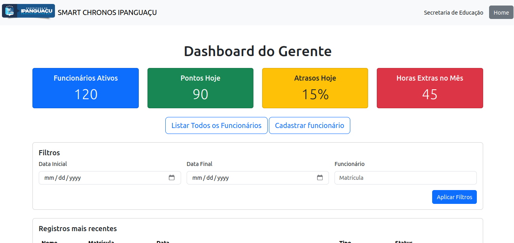
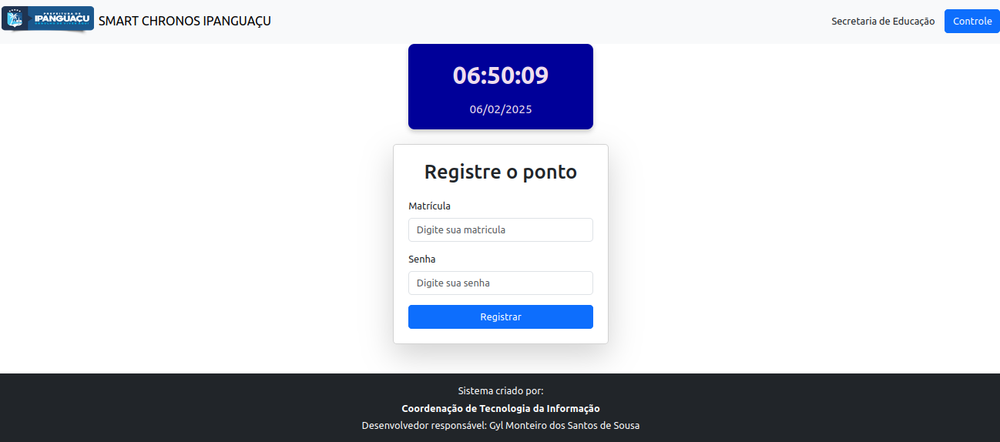
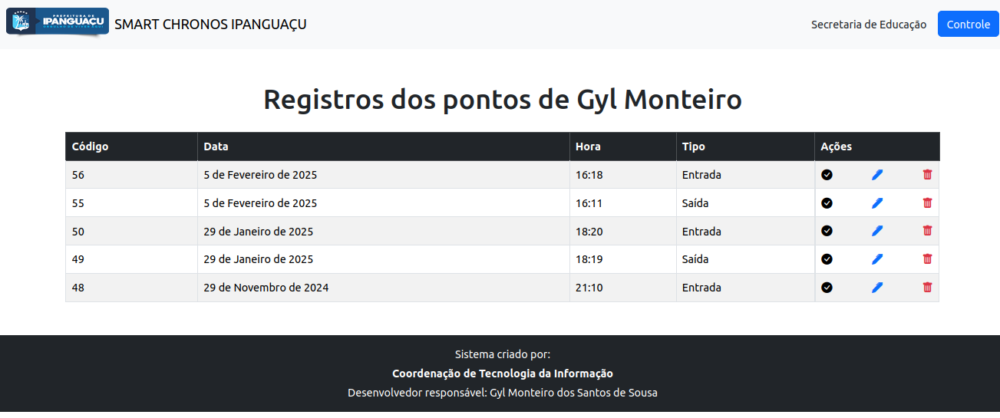

# SmartChronos

## Objetivo do Projeto

Sistema de controle e registro de ponto eletrônico.

## Como Executar o Projeto

1. Clone o repositório: `git clone git@github.com:gylmonteiro-dev/smartchronos.git`
2. Crie um ambiente virtual em Python: `python3 -m venv .venv`
3. Ative o ambiente virtual:
    * Linux/macOS: `source .venv/bin/activate`
    * Windows: `.venv\Scripts\activate`
4. Instale as dependências do projeto: `pip install -r requirements.txt`
5. Realize as migrações: `python manage.py migrate`
6. Crie um super usuário: `python manage.py createsuperuser`
7. Rode o projeto: `python manage.py runserver`

## Descrição

O projeto SmartChronos foi idealizado para suprir a necessidade de um sistema de ponto eletrônico no ambiente de trabalho da secretaria municipal de educação de Ipanguaçu. O sistema conta com uma interface simplificada para registrar os pontos dos funcionários e um painel de gerenciamento para coordenadores e gerentes.

O sistema realiza a alternância do ponto de Entrada e Saída de forma automatizada. Além disso, dentro do painel de controle, é possível visualizar os últimos registros, bem como realizar a atualização, validação e exclusão de registros feitos através do gerente ou coordenador local. A característica mais forte do sistema encontra-se na simplicidade de operacionalizar o sistema.

## Funcionalidades do Projeto

* Registrar ponto de trabalho por matrícula e senha;
* Controle de validação, atualização e exclusão de registros de pontos;
* Criação de contas de usuários;
* Relatórios em dashboard para o gerente ou coordenador;
* Visualização rápida dos últimos registros;
* Exibição de quantidade de funcionários ativos;
* Número de pontos registrados no dia.

## Próximas Funcionalidades

* Geolocalização automática;
* Registro por reconhecimento facial;
* Geração de relatórios em PDF.
